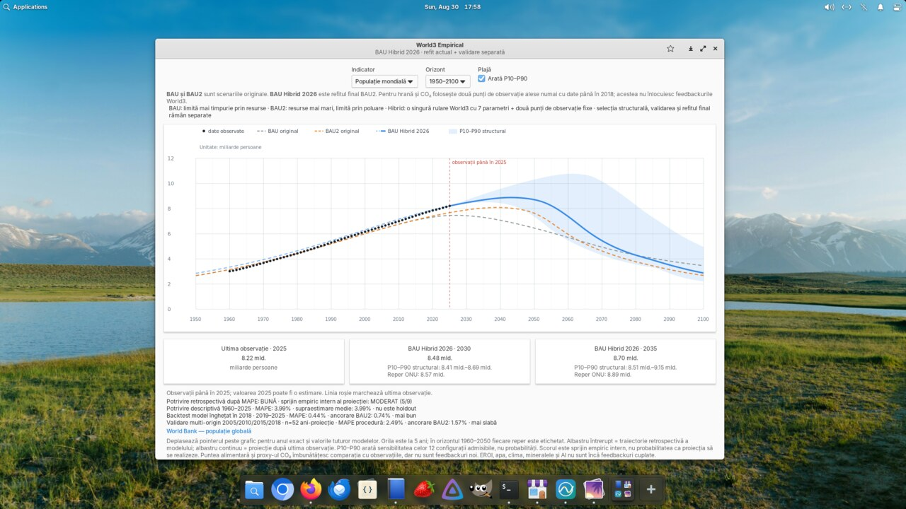

<p align="center">
  
</p>

<h1 align="center">World3 Empirical</h1>

<p align="center">
  Explore the original World3 BAU and BAU2 trajectories alongside observed global data and the conditional BAU Hibrid 2026 scenario.
</p>

<p align="center">
  
  
  
  
</p>



Aplicație nativă Vala/GTK 4 pentru elementary OS 8. Compară date globale
observate cu scenariile World3-03 originale și cu o variantă empirică derivată
din BAU2. După instalare funcționează complet offline.

Interfața și documentația principală sunt în limba română. An English summary
is available in the [project description](#english-summary).

## Ce afișează

Aplicația păstrează doar trei trasee, pentru ca diferențele să poată fi citite
fără ambiguitate:

| Traseu | Ce reprezintă |
|---|---|
| **BAU original** | Scenariul World3-03 de referință, păstrat nemodificat. |
| **BAU2 original** | Scenariul 2 World3-03, cu resurse inițiale mai mari; este păstrat nemodificat. |
| **BAU Hibrid 2026** | O singură rulare World3 derivată structural din BAU2, calibrată comun față de observații și continuată condițional după ultimul an observat. |

Punctele negre sunt observații independente, nu părți ale curbelor. Segmentul
albastru întrerupt este reconstrucția retrospectivă a hibridului, iar segmentul
albastru continuu este proiecția. Banda P10–P90 descrie sensibilitatea la cele
12 configurații structurale admisibile; nu este un interval de încredere și
nu exprimă probabilitatea unui „colaps”.

## Funcții principale

- opt grafice pentru populație, industrie, hrană, CO₂/proxy de activitate,
  bunăstare, producție industrială totală, poluare persistentă și resurse;
- grilă verticală la cinci ani și citirea sub pointer a anului și valorilor
  celor trei trasee;
- separarea vizuală dintre observații, reconstrucția retrospectivă și
  proiecția de după ultimul an observat;
- rezultate de backtesting recent și validare multi-origin, afișate separat de
  potrivirea istorică;
- diagnostic pentru identificabilitatea parametrilor și control pentru
  ascunderea benzii de sensibilitate;
- date și metodă incluse local, fără conexiune la internet în timpul utilizării.

## Ce este BAU Hibrid 2026

BAU Hibrid 2026 pornește din structura scenariului 2 al World3-03. Cele cinci
ținte calibrate și cele trei diagnostice provin din aceeași rulare și din
același vector de șapte parametri; curbele nu sunt ajustate independent.

Procedura evaluează 128 de configurații predeclarate. Selecția de validare
folosește numai date încheiate în 2018, iar anii ulteriori formează un test
recent neatins. După evaluare, linia afișată este refăcută cu toate observațiile
disponibile până în 2023–2025, în funcție de indicator. Centrul este o rulare
World3 efectivă, aleasă dintre 12 configurații finale admisibile.

Pentru hrană și CO₂ anual sunt folosite două punți de observație alese numai cu
date pre-2019. Ele îmbunătățesc legătura dintre stările World3 și indicatorii
observați, dar nu adaugă sectoare sau feedbackuri noi modelului.

Metoda completă, parametrii, erorile și limitele sunt documentate în
[SCIENTIFIC_METHOD.md](SCIENTIFIC_METHOD.md). Datele și configurațiile pot fi
auditate în [`data/scenarios`](data/scenarios), iar istoricul versiunilor este
în [CHANGELOG.md](CHANGELOG.md).

> **Limită esențială:** BAU Hibrid 2026 este un scenariu experimental și
> condițional. Nu estimează probabilitatea unui colaps, nu identifică unic
> parametrii reali ai sistemului mondial și nu trebuie citit ca o prognoză
> punctuală garantată.

## Date folosite

- World Bank WDI — populație și valoare adăugată a industriei;
- FAOSTAT Production Indices — producție alimentară mondială pe locuitor;
- World Bank/EDGAR — emisii antropice anuale folosite ca proxy observabil;
- UNDP Human Development Report 2025 — HDI;
- UN World Population Prospects 2024 — reper demografic extern;
- World3-03 — scenariile originale BAU și BAU2.

Energy Institute Statistical Review 2026 și ancorele IEA pentru centre de date
sunt păstrate pentru dezvoltarea viitoare. EROI, clima, apa, mineralele,
infrastructura AI, conflictele și politicile nu sunt încă feedbackuri cuplate
în rularea centrală.

## Instalare pe elementary OS 8

Repository-ul oferă în prezent o construire Flatpak reproductibilă din sursă.
Un pachet Flatpak publicat ca GitHub Release va fi adăugat separat; până atunci,
clonarea și construirea locală reprezintă metoda verificată de instalare.

Instalează o singură dată SDK-ul elementary și Flatpak Builder:

```bash
flatpak install --user appcenter io.elementary.Platform//8 io.elementary.Sdk//8
flatpak install --user flathub org.flatpak.Builder
```

Apoi clonează, construiește și instalează aplicația:

```bash
git clone https://github.com/LaurentiuStaicu/world3-empirical-flatpak.git
cd world3-empirical-flatpak
./build-flatpak.sh
```

Dacă arhiva ZIP a pierdut permisiunea de execuție a scriptului, rulează o
singură dată `chmod +x build-flatpak.sh`.

Pornire:

```bash
flatpak run io.github.laurentiustaicu.World3Empirical
```

Scriptul rulează validarea statică înainte de fiecare construire. Validarea
poate fi pornită și separat:

```bash
python3 scripts/validate.py
```

## Dezvoltare

Manifestul Flatpak folosește `io.elementary.Sdk//8`, Meson, Vala, GTK 4 și
Granite 7. Codul auditabil din `model/` generează scenariile experimentale de
energie netă/EROI, dar nu este executat în timpul construirii aplicației.

Problemele reproductibile pot fi raportate în
[GitHub Issues](https://github.com/LaurentiuStaicu/world3-empirical-flatpak/issues).

## Limite și licențe

Agregarea globală ascunde diferențele regionale și distribuționale. Industria
World Bank și HDI sunt proxy-uri, iar stocul persistent de poluare și resursele
rămase sunt stări World3 latente, nu observații directe. Lista completă a
limitelor este în [documentația metodei](SCIENTIFIC_METHOD.md).

Codul aplicației este publicat sub licența [MIT](LICENSE). Seriile FAOSTAT sunt
CC BY 4.0; celelalte seturi de date își păstrează termenii
instituțiilor-sursă. Proveniența numerică este documentată în manifest.

## English summary

World3 Empirical is an offline elementary OS 8 application for comparing
observed global indicators with the original World3-03 BAU and BAU2 scenarios
and BAU Hibrid 2026, an experimental BAU2-derived calibration. It provides
eight interactive charts, five-year grid lines, retrospective validation,
multi-origin backtesting and a structural sensitivity range. Projections are
conditional scenarios, not guaranteed point forecasts or collapse
probabilities.
